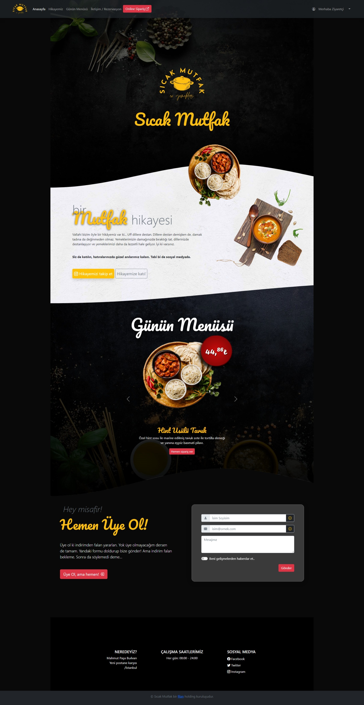

# ***Sıcak Mutfak***: İsmek Front-End Developer kursu için **bootstrap** sayfa çalışması

Varsayılan Dal, bu proje için `static`tir. Modüler versiyonu `main` dalda tuttum. Bu site ilk olarak Modüler ES6 ile yazılmıştır. Ancak `file://` sistemiyle uyumlu hale getirmek için statik ES6 sözdizimine değiştirilir. Modüller tek bir `.js` dosyasına entegre edildi. Modüler versiyona bir göz atmak için dalı `main` olarak değiştirin. Ancak geliştirme süreci `static` dalda devam ettiği için güncel olmayabilir.

*Default Branch is `static` for this project. I've kept the modular version on `main` branch. This site was firstly written in ES6 Modular. But to make compatible with `file://` system it is changed to static ES6 syntax. Modules were integrated into one `.js` file. To take a look at modular version change branch to `main`. But it could be outdated, because the development process continued on `static` branch.*

## Menü tıklamaları ve scroll sırasında menünün değişmesi

[script.js](https://github.com/mstytn/sicak-mutfak/blob/static/script.js) dosyası sadece bu işlevi görüyor. Daha sonraki projelerimde [gsap - scrolltrigger](https://greensock.com/scrolltrigger/) kullandım. Bu projede bu işlevi kendim yazdım. OOP kullanmadım. Sadece bu siteye özgü olarak yazdım. Fakat, menü ve anchor(hash)'lerin aynı olduğu varsayımıyla,

```javascript
const anchors = ['story', 'selected', 'rezerv']
/** Son contact ve en baş anasayfa hash'leri dahil edimedi,
 * çünkü fonksiyon sayfa en başa ve en sona scroll olduğunda
 * en baş ve en son hash'i kendisi seçiyor. 
*/
```

ancorları bir `Array` de topladım. Sayfa `scroll event` gerçekleştiğinde scroll edilen pozisyonu anchorların pozisyonu ile karşılaştırıp sayfanın en üştüne en yakın olan anchor'un adı ile geçen menü elemanını css `class` ismi ile çağırıp `active` sınıfı ekliyor. Diğerlerinden de kaldırıyor. Bu işlevi yazarken sayfa `resize` edildiğinde kayıtlı anchor pozisyonlarının değiştiğini farketmemle, hem `window.onload` hem de `window.onresize` eventlerinde bu element pozisyonlarını kaydeden fonksiyonu tekrar çağırdım. Bu aslında client tarafında gereksiz bir iş yükü yarattı. Çözüm olarak resize event'e bir `setTimeout` fonksiyonu ile çözülebileceğini düşündüm ama implement etmedim. İmplement edilebilecek kodu ise aşağıda ayrıca paylaşıyorum:

```javascript
//OOP Kullanmadığımdan global scope'a boş bir değişken atama:
let timeout

/**
 * Her scroll event girişinde bir timeout başlatan ve bir önce oluşturduğunu 
 * temizleyen fonksiyon. Böylece resize işlemi tekrarlanmazsa 
 * (Yani resize işlemi sonlandığında) timeout silinmeyip 
 * 500ms sonra anchor noktalarını günceller.
 * Böylece işlem yükü belli oranda azaltılmış olur.
 * Çok fazla anchor noktası içermediğinden şu an bu fonksiyonu eklemek
 * gereksiz geldi bana. Sonuçta client tarafonda çalışıyor. Ve çok fazla bir
 * işlem yüküne neden olmuyor. Chrome developer tools'ta da bir uyarı vermediğinden
 * koda eklemedim.
 * */
window.addEventListener('resize', _event => {
  if (timeout)
    clearTimeout(timeout)
  timeout = setTimeout(
    ancPoses = getAnchorPoses(anchors), 500
    // ancPoses: [Number] global scope'da anchor noktalatının kaydını tutan bir array.
    // anchors: [String] global scope'da anchor noktalatının id'lerini tutan array.
    //
    // getAnchorPoses([String]): function([string]): retrurns [Number] 
    // global scope'da verilen anchorların pozisyonarını döndüren fonksiyon.
  )
})
```

## Screenshot


